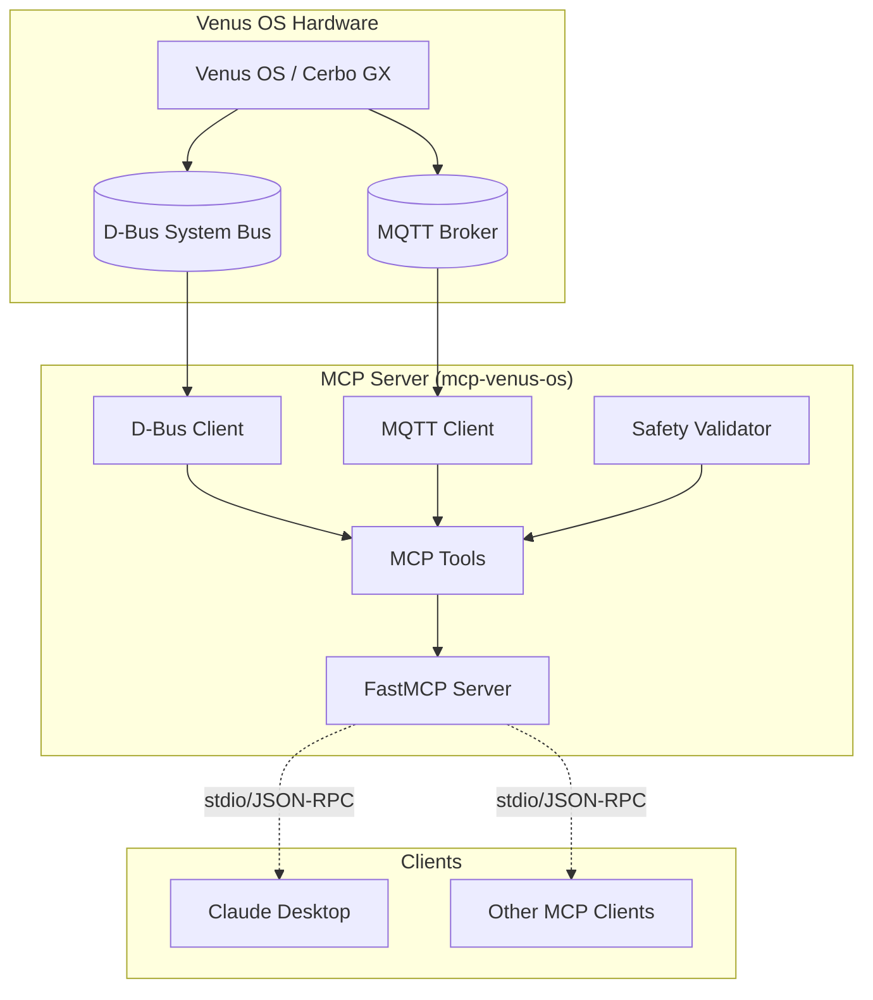

# MCP Venus OS

[](https://github.com/4alvit/mcp-venus-os/actions/workflows/codeql.yml)
[](https://github.com/4alvit/mcp-venus-os/actions/workflows/scorecards.yml)
[](https://github.com/4alvit/mcp-venus-os/actions/workflows/dependency-review.yml)
[](https://opensource.org/licenses/MIT)
[](https://www.python.org/downloads/)
[]()
[](https://github.com/4alvit/mcp-venus-os/stargazers)
[](https://github.com/4alvit/mcp-venus-os/network/members)
[](https://github.com/4alvit/mcp-venus-os/commits/main)
[](https://github.com/4alvit/mcp-venus-os/graphs/commit-activity)
[](https://www.python.org/)
[](https://modelcontextprotocol.io/)

MCP (Model Context Protocol) server for Victron Venus OS management. Provides tools for reading and controlling Venus OS devices via D-Bus and MQTT.

## Features

- **D-Bus Read Tools**: Battery SoC, PV power, grid status, inverter state
- **Write Tools**: Set inverter mode, charge limits, SoC limits (with safety confirmation)
- **MQTT Subscription**: Real-time data streaming from Venus OS
- **Safety Constraints**: Refuses dangerous commands without explicit confirmation
- **Claude Desktop Integration**: Ready-to-use MCP server configuration

## Quick Start

### Installation

Not yet on PyPI. Install from GitHub:

```bash
pip install git+https://github.com/4alvit/mcp-venus-os
```

Or for development:

```bash
git clone https://github.com/4alvit/mcp-venus-os
cd mcp-venus-os
uv sync
```

### Configuration

Create a `.env` file or set environment variables:

```bash
# D-Bus configuration
DBUS_BUS_TYPE=system
DBUS_SERVICE_NAME=com.victronenergy

# MQTT configuration
MQTT_HOST=localhost
MQTT_PORT=1883
MQTT_BASE_TOPIC=N/venus-os

# Safety configuration
SAFETY_REQUIRE_CONFIRMATION=true
SAFETY_MAX_CHARGE_CURRENT=100
SAFETY_MAX_DISCHARGE_CURRENT=100
SAFETY_MIN_SOC_LIMIT=10
SAFETY_MAX_SOC_LIMIT=100
SAFETY_ALLOWED_MODES=on,off,charger_only,inverter_only,eco
```

### Running the Server

```bash
mcp-venus-os
```

Or with uv:

```bash
uv run mcp-venus-os
```

### Claude Desktop Integration

Add to your `claude_desktop_config.json`:

```json
{
  "mcpServers": {
    "venus-os": {
      "command": "uv",
      "args": ["--directory", "/path/to/mcp-venus-os", "run", "mcp-venus-os"],
      "env": {
        "DBUS_BUS_TYPE": "system",
        "MQTT_HOST": "localhost",
        "MQTT_PORT": "1883"
      }
    }
  }
}
```

## Available Tools

### Read Tools

| Tool | Description |
|------|-------------|
| `get_battery_soc` | Get battery state of charge, voltage, current, power, temperature |
| `get_pv_power` | Get PV/solar charger power, voltage, current, daily/total yield |
| `get_grid_status` | Get grid/AC power, voltage, current, frequency, status |
| `get_inverter_status` | Get inverter mode, state, AC/DC power, temperature |
| `list_devices` | List all Victron devices on D-Bus |

### Write Tools (Requires Confirmation)

| Tool | Description |
|------|-------------|
| `set_inverter_mode` | Set inverter mode: `on`, `off`, `charger_only`, `inverter_only`, `eco` |
| `set_charge_current_limit` | Set maximum charge current in Amps |
| `set_soc_limit` | Set battery SoC limit percentage |

### MQTT Tools

| Tool | Description |
|------|-------------|
| `mqtt_connect` | Connect to MQTT broker |
| `mqtt_disconnect` | Disconnect from MQTT broker |
| `mqtt_subscribe` | Subscribe to MQTT topic pattern |

## Safety System

All write operations require explicit confirmation by default. Set `confirmed=true` in the tool call to bypass the confirmation prompt.

Configuration options:
- `SAFETY_REQUIRE_CONFIRMATION` - Require confirmation for write operations (default: true)
- `SAFETY_MAX_CHARGE_CURRENT` - Maximum allowed charge current in Amps (default: 100)
- `SAFETY_MAX_DISCHARGE_CURRENT` - Maximum allowed discharge current in Amps (default: 100)
- `SAFETY_MIN_SOC_LIMIT` - Minimum allowed SoC limit % (default: 10)
- `SAFETY_MAX_SOC_LIMIT` - Maximum allowed SoC limit % (default: 100)
- `SAFETY_ALLOWED_MODES` - Comma-separated list of allowed inverter modes

## Architecture



## Development

```bash
# Install dev dependencies
uv sync --dev

# Run linter
uv run ruff check src/

# Run type checker
uv run mypy src/

# Run tests
uv run pytest
```

## License

MIT License - see LICENSE file for details.