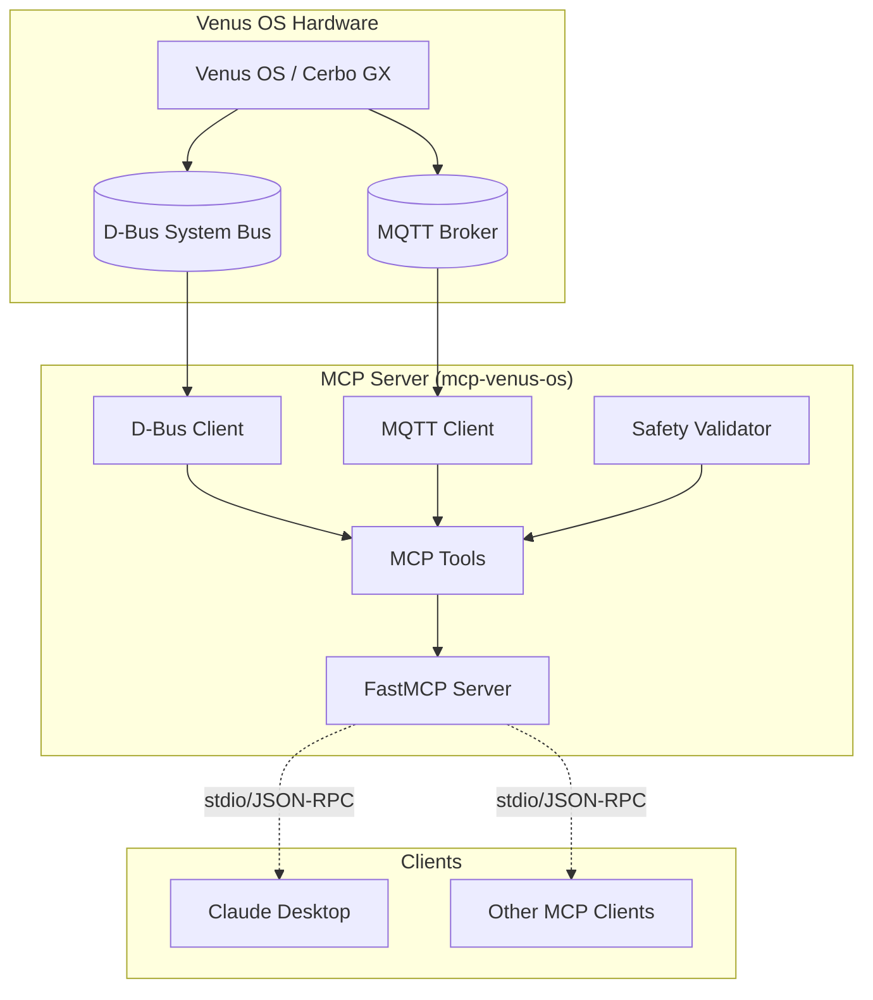

# MCP Venus OS

[](https://github.com/4alvit/mcp-venus-os/actions/workflows/codeql.yml)
[](https://github.com/4alvit/mcp-venus-os/actions/workflows/scorecards.yml)
[](https://github.com/4alvit/mcp-venus-os/actions/workflows/dependency-review.yml)
[](https://opensource.org/licenses/MIT)
[](https://www.python.org/downloads/)
[]()
[](https://github.com/4alvit/mcp-venus-os/commits/main)
[](https://github.com/4alvit/mcp-venus-os/graphs/commit-activity)
[](https://www.python.org/)
[](https://modelcontextprotocol.io/)

MCP (Model Context Protocol) server for Victron Venus OS management. Primary transport is the **Venus OS MQTT gateway** (`N/<portalId>/…` reads, `W/<portalId>/…` writes) so the server can run off-device; direct D-Bus remains available for on-device installs.

## Features

- **MQTT read path**: subscribes `N/<portalId>/#` on the Cerbo GX gateway and serves tools from a stale-guarded cache (`stale`, `age_seconds` per reading)
- **Write tools over `W/` topics**: inverter mode, charge-current limit, SoC limit — each write is kept alive (≤60s expiry) and verified by read-back before reporting success
- **Safety constraints**: confirmation gate + hard limits enforced before any publish
- **Two server transports**: stdio (Claude Code launches the process) or streamable HTTP with optional bearer-token auth (Synology Docker / shared use)
- **Optional D-Bus backend**: unchanged behavior for installs running directly on the Cerbo

## Quick Start

### Installation

Not yet on PyPI. Install from GitHub:

```bash
pip install git+https://github.com/4alvit/mcp-venus-os
```

Or for development:

```bash
git clone https://github.com/4alvit/mcp-venus-os
cd mcp-venus-os
uv sync
```

### Prerequisites (Cerbo GX)

1. Settings → Services → **MQTT Gateway**, mode = *Local network* (listens on LAN :1883)
2. Note the **portal ID** shown on the MQTT Gateway page (also `com.victronenergy.system/Serial`)
3. Verify: `mosquitto_sub -h <cerbo-ip> -t 'N/<portalId>/system/#' -v` returns telemetry

### Configuration

Create a `.env` file from [`.env.sample`](.env.sample) or set environment variables:

```bash
TRANSPORT_BACKEND=mqtt          # mqtt (default) | dbus (on-device only)
SERVER_TRANSPORT=stdio          # stdio (default) | http

# MQTT — Venus OS gateway on the Cerbo
MQTT_HOST=<cerbo-ip>
MQTT_PORT=1883
MQTT_PORTAL_ID=<venus-portal-id>
MQTT_STALE_AFTER_SECONDS=60

# Safety
SAFETY_REQUIRE_CONFIRMATION=true
SAFETY_MAX_CHARGE_CURRENT=100
SAFETY_MAX_DISCHARGE_CURRENT=100
SAFETY_MIN_SOC_LIMIT=10
SAFETY_MAX_SOC_LIMIT=100
SAFETY_ALLOWED_MODES=on,off,charger_only,inverter_only,eco

# HTTP mode extras
SERVER_HOST=127.0.0.1           # 0.0.0.0 inside containers
SERVER_PORT=8000
SERVER_AUTH_TOKEN=              # optional bearer token for HTTP mode
```

### Running the Server

```bash
uv run mcp-venus-os                   # stdio (Claude Code launches this)
uv run mcp-venus-os --transport http  # or SERVER_TRANSPORT=http
```

### Deployment Matrix

| Target | Transport backend | Server transport | Notes |
|--------|-------------------|------------------|-------|
| macOS (same machine as Claude Code) | `mqtt` → Cerbo LAN | `stdio` | registered user-scope via `claude mcp add` |
| Synology Docker | `mqtt` → Cerbo LAN | `http` :8000 | compose in repo, optional bearer token |
| On-device (Cerbo) | `dbus` | `stdio` | legacy mode, no gateway needed |

Docker:

```bash
cp .env.sample .env   # fill in cerbo IP + portal id (+ token if exposing beyond LAN)
docker compose up -d  # healthcheck hits GET /mcp until the MCP endpoint answers
```

### Claude Code Registration

```bash
claude mcp add --scope user venus-os \
  -e TRANSPORT_BACKEND=mqtt -e MQTT_HOST=<cerbo-ip> -e MQTT_PORTAL_ID=<id> \
  -- uv --directory /path/to/mcp-venus-os run mcp-venus-os
```

For the Synology HTTP deployment, point clients at `http://<synology-ip>:8000/mcp`
(send `Authorization: Bearer $SERVER_AUTH_TOKEN` when configured).

DSM notes (deployed at `/volume1/docker/mcp-venus-os/`):

- Plain `docker compose` (full path `/usr/local/bin/docker`) works fine; Container Manager is not required.
- Host port 8000 is taken by Portainer on typical DSM installs — remap in the compose `ports:` (e.g. `"8080:8000"`).
- SFTP/scp may be disabled; copy files via `ssh ... 'cat > file'`.
- The `.env` (portal id, token) lives only on the NAS, mode 600.

## Available Tools

### Read Tools

| Tool | Description |
|------|-------------|
| `get_battery_soc` | Battery SoC, voltage, current, power, temperature (+ `stale`, `age_seconds`) |
| `get_pv_power` | PV/solar charger power, voltage, current, yields (power falls back to V×I) |
| `get_grid_status` | Grid power, voltage, current, frequency from the `system/0` aggregates |
| `get_inverter_status` | Inverter mode, state, AC/DC power, temperature |
| `list_devices` | Devices discovered from received MQTT topics |

### Write Tools (Requires Confirmation)

| Tool | Writes to | Notes |
|------|-----------|-------|
| `set_inverter_mode` | `W/…/vebus/<instance>/Mode` | mode name → enum code via per-device table; unknown combos rejected before publishing |
| `set_charge_current_limit` | `W/…/vebus/<instance>/Dc/0/MaxChargeCurrent` | Amps |
| `set_soc_limit` | `W/…/battery/<instance>/SocLimit` | % — confirm exact BMS path on target battery |

### MQTT Tools

| Tool | Description |
|------|-------------|
| `mqtt_connect` | Connect to the Cerbo gateway and prime the read cache |
| `mqtt_disconnect` | Disconnect; cancels all write keepalives |
| `mqtt_subscribe` | Stub — reports "not yet implemented" rather than pretending success |

## MQTT Topic Map

The server speaks the Venus OS **MQTT-Gateway** protocol:

```
N/<portalId>/<type>/<instance>/<Path>          reads   (published by Venus)
W/<portalId>/<type>/<instance>/<Path>          writes  (published by us)
W/<portalId>/<type>/<instance>/<Path>/Keepalive  empty payload every 50s while a written value must stay active
```

- Reads: on connect we subscribe `N/<portalId>/#` and cache the last value per
  topic with its receive time; tool output carries `stale` + `age_seconds`
  (threshold `MQTT_STALE_AFTER_SECONDS`, default 60).
- Writes: value published as JSON to `W/…`; Venus expires writes unless
  `<Path>/Keepalive` receives an empty payload at least every 60s — we send
  every 50s and cancel all keepalives on disconnect/shutdown.
- Verification: after each write the matching `N/…` topic is polled for up to
  5s (`WRITE_VERIFY_TIMEOUT_S`); timeout → explicit error, never silent success.

## Safety Model

Defense runs in order, before any publish:

1. **Confirmation gate** (`SAFETY_REQUIRE_CONFIRMATION=true`): first call without
   `confirmed=true` returns a confirmation prompt instead of writing.
2. **Hard limits**: charge/discharge current ≤ configured maxima; SoC limits
   clamped to `[SAFETY_MIN_SOC_LIMIT, SAFETY_MAX_SOC_LIMIT]`; inverter modes
   restricted to `SAFETY_ALLOWED_MODES`.
3. **Mode enum mapping**: only modes with a known device-type enum code reach
   the wire; anything else is rejected pre-publish.
4. **Read-back verification** closes the loop — an unacknowledged write is
   reported as failed.

Known caveats: vebus/inverter/solarcharger Mode enum tables come from Victron's
documented enums but should be sanity-checked against your firmware before
relying on non-default modes; the exact SoC-limit path depends on the battery
BMS.

Configuration options:
- `SAFETY_REQUIRE_CONFIRMATION` - Require confirmation for write operations (default: true)
- `SAFETY_MAX_CHARGE_CURRENT` - Maximum allowed charge current in Amps (default: 100)
- `SAFETY_MAX_DISCHARGE_CURRENT` - Maximum allowed discharge current in Amps (default: 100)
- `SAFETY_MIN_SOC_LIMIT` - Minimum allowed SoC limit % (default: 10)
- `SAFETY_MAX_SOC_LIMIT` - Maximum allowed SoC limit % (default: 100)
- `SAFETY_ALLOWED_MODES` - Comma-separated list of allowed inverter modes

## Architecture



## Development

```bash
# Install dev dependencies
uv sync --dev

# Run linter
uv run ruff check src/

# Run type checker
uv run mypy src/

# Run tests
uv run pytest
```

## License

MIT License - see LICENSE file for details.