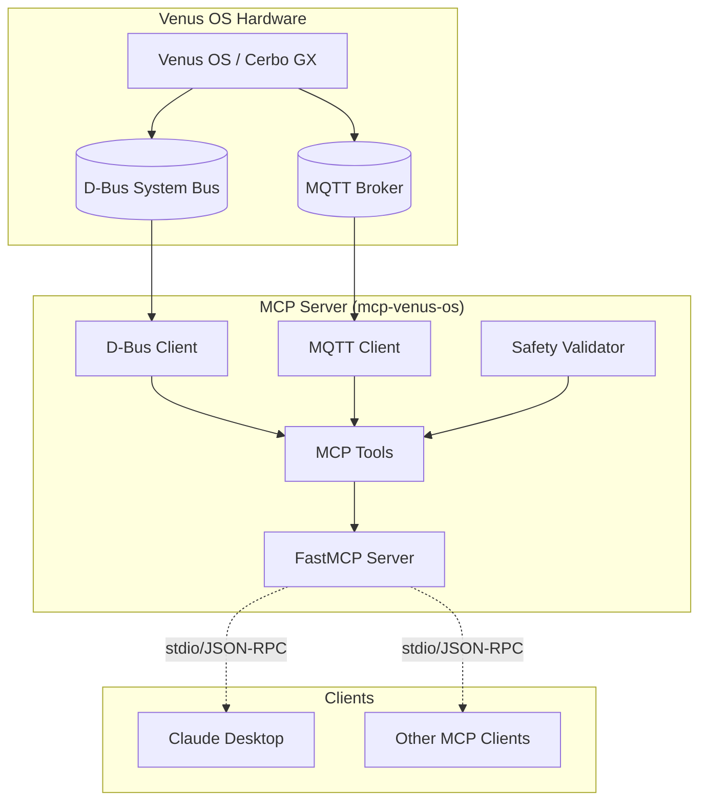

# MCP Venus OS

## Venus OS deployment notes

Prefer the MQTT backend on a NAS, server, or workstation. It keeps the MCP/HTTP
runtime off a constrained GX while using the existing Venus MQTT gateway.
The Cerbo audit on 2026-09-12 found no native `mcp-venus-os` service; the documented
Synology deployment is a separate host and must be checked there.

For an off-device HTTP deployment, configure an operator-owned HTTPS endpoint
and bearer authentication. Start with device writes disabled and no Cerbo SSH
credentials. Keep the deployment manifest, image pin, credentials, verification
record and rollback plan with the operator's deployment configuration. The
[deployment matrix](#deployment-matrix) and [HTTP authentication setup](#http-auth-token)
below describe the supported transports and client configuration.

SSH package refresh downloads into a temporary `/data` staging directory and
validates that `setup` exists before copying into the installed tree. It retains
files absent from the release, including virtualenvs and local configuration,
and calls `setup install` without interactive stdin. Package-owned uninstall
handles service removal; there is no recursive-delete fallback. A release can
still replace same-named tracked files, so keep local secrets in the package's
documented external configuration files and retain a backup before upgrades.


[](https://github.com/4alvit/mcp-venus-os/actions/workflows/codeql.yml)
[](https://github.com/4alvit/mcp-venus-os/actions/workflows/scorecards.yml)
[](https://github.com/4alvit/mcp-venus-os/actions/workflows/dependency-review.yml)
[](https://opensource.org/licenses/MIT)
[](https://www.python.org/downloads/)
[]()
[](https://github.com/4alvit/mcp-venus-os/commits/main)
[](https://github.com/4alvit/mcp-venus-os/graphs/commit-activity)
[](https://www.python.org/)
[](https://modelcontextprotocol.io/)

MCP (Model Context Protocol) server for Victron Venus OS management. Primary transport is the **Venus OS MQTT gateway** (`N/<portalId>/…` reads, `W/<portalId>/…` writes) so the server can run off-device; direct D-Bus remains available for on-device installs.

<!-- ci-release-process:start -->
## Release process

See the [release strategy](RELEASING.md) for validation, nightly, beta, RC and stable promotion rules, and the [operator runbook](docs/release-workflow.md) for local commands.
<!-- ci-release-process:end -->

## Features

- **MQTT read path**: subscribes to discovery markers and the exact telemetry paths consumed by tools and configured hardware contracts, then serves a stale-guarded cache (`stale`, `age_seconds` per reading)
- **Write tools over `W/` topics**: inverter mode, charge-current limit, SoC limit — exact hardware contracts and fresh read-back are required; no automatic rollback is provided
- **Safety constraints**: confirmation gate + hard limits enforced before any publish
- **Two server transports**: stdio (Claude Code launches the process) or streamable HTTP with optional bearer-token auth (Synology Docker / shared use)
- **Optional D-Bus backend**: unchanged behavior for installs running directly on the Cerbo

## Quick Start

### Installation

Not yet on PyPI. Install from GitHub:

```bash
pip install git+https://github.com/4alvit/mcp-venus-os
```

Or for development:

```bash
git clone https://github.com/4alvit/mcp-venus-os
cd mcp-venus-os
uv sync
```

### Prerequisites (Cerbo GX)

1. Settings → Services → **MQTT Gateway**, mode = *Local network* (listens on LAN :1883)
2. Note the **portal ID** shown on the MQTT Gateway page (also `com.victronenergy.system/Serial`)
3. Verify: `mosquitto_sub -h <cerbo-ip> -t 'N/<portalId>/system/#' -v` returns telemetry

### Configuration

Create a `.env` file from [`.env.sample`](.env.sample) or set environment variables:

```bash
TRANSPORT_BACKEND=mqtt          # mqtt (default) | dbus (on-device only)
SERVER_TRANSPORT=stdio          # stdio (default) | http

# MQTT — Venus OS gateway on the Cerbo
MQTT_HOST=<cerbo-ip>
MQTT_PORT=1883
MQTT_PORTAL_ID=<venus-portal-id>
MQTT_STALE_AFTER_SECONDS=60

# Safety
SAFETY_REQUIRE_CONFIRMATION=true
SAFETY_MAX_CHARGE_CURRENT=100
SAFETY_MAX_DISCHARGE_CURRENT=100
SAFETY_MIN_SOC_LIMIT=10
SAFETY_MAX_SOC_LIMIT=100
SAFETY_ALLOWED_MODES=on,off,charger_only,inverter_only,eco
SAFETY_ENABLE_WRITES=false       # MUST be true to enable any write/control tools

# HTTP mode extras
SERVER_HOST=127.0.0.1           # 0.0.0.0 inside containers
SERVER_PORT=8000
SERVER_AUTH_TOKEN=              # optional bearer token for HTTP mode
```

### Running the Server

```bash
uv run mcp-venus-os                   # stdio (Claude Code launches this)
uv run mcp-venus-os --transport http  # or SERVER_TRANSPORT=http
```

### Deployment Matrix

| Target | Transport backend | Server transport | Notes |
|--------|-------------------|------------------|-------|
| **MP Kubernetes (shared)** | `mqtt` → Cerbo LAN | HTTPS `/mcp` | `venus-os.k3s.2560801.xyz`, bearer token, device writes disabled |
| Synology Docker (alternative) | `mqtt` → Cerbo LAN | `http` :8080 | saved deployment layout; verify host availability |
| macOS (fallback) | `mqtt` → Cerbo LAN | `stdio` | local process via `claude mcp add`, no NAS dependency |
| On-device (Cerbo) | `dbus` | `stdio` | legacy mode, no gateway needed |

Docker:

```bash
cp .env.sample .env   # fill in cerbo IP + portal id (+ token if exposing beyond LAN)
docker compose up -d  # healthcheck hits GET /mcp until the MCP endpoint answers
```

### HTTP Auth Token

HTTP mode is protected by a static bearer token (`SERVER_AUTH_TOKEN`). Without it the
server runs unauthenticated — only sensible on a trusted home LAN.

Generate and apply:

```bash
openssl rand -hex 24          # generate once
echo 'SERVER_AUTH_TOKEN=<hex>' >> .env   # add to the deployment .env
docker compose up -d          # restart so the container picks it up
```

Clients then send `Authorization: Bearer <token>` on every request. Unauthenticated or
wrong-token requests get `401`. For Claude Code:

```bash
claude mcp add --scope user --transport http venus-os \
  https://venus-os.k3s.2560801.xyz/mcp \
  --header "Authorization: Bearer <token>"
```

Or via the project-level [`.mcp.json`](.mcp.json), which reads the token from the
`VENUS_MCP_TOKEN` environment variable (`export VENUS_MCP_TOKEN=<hex>` before launching
Claude Code):

```json
{
  "mcpServers": {
    "venus-os": {
      "type": "http",
      "url": "https://venus-os.k3s.2560801.xyz/mcp",
      "headers": { "Authorization": "Bearer ${VENUS_MCP_TOKEN}" }
    }
  }
}
```

### Claude Code Registration

Primary (shared MP HTTPS endpoint — see above). Fallback: launch the server locally
so it works even when the NAS is down:

```bash
claude mcp add --scope user venus-os \
  -e TRANSPORT_BACKEND=mqtt -e MQTT_HOST=<cerbo-ip> -e MQTT_PORTAL_ID=<id> \
  -- uv --directory /path/to/mcp-venus-os run mcp-venus-os
```

DSM notes (deployed at `/volume1/docker/mcp-venus-os/`):

The 2026-09-12 audit found this directory still present, but no MCP container
in the NAS Docker inventory, including stopped containers. Treat the instructions
below as the saved deployment layout, not evidence of a currently running
endpoint. Verify the existing configuration and host before enabling it again.

- Plain `docker compose` (full path `/usr/local/bin/docker`) works fine; Container Manager is not required.
- Host port 8000 is taken by Portainer on typical DSM installs — remap in the compose `ports:` (e.g. `"8080:8000"`).
- SFTP/scp may be disabled; copy files via `ssh ... 'cat > file'`.
- The `.env` (portal id, token) lives only on the NAS, mode 600.

### Container Images

The reviewed publication mapping is `ghcr.io/4alvit/mcp-venus-os`. Candidate builds produce an OCI archive; approved stable bytes are promoted separately to the registry without rebuilding. Follow the [operator runbook](docs/release-workflow.md) for the versioned tag and optional `latest` update. The former main/tag-triggered GHCR and Docker Hub publishers are retired.

## Available Tools

### Read Tools

| Tool | Description |
|------|-------------|
| `get_battery_soc` | Battery SoC, voltage, current, power, temperature (+ `stale`, `age_seconds`) |
| `get_pv_power` | PV/solar charger power, voltage, current, yields (power falls back to V×I) |
| `get_grid_status` | Grid power, voltage, current, frequency from the `system/0` aggregates |
| `get_inverter_status` | Inverter mode, state, AC/DC power, temperature |
| `list_devices` | Devices discovered from received MQTT topics |

### Write Tools (Requires Confirmation)

| Tool | Writes to | Notes |
|------|-----------|-------|
| `set_inverter_mode` | `W/…/vebus/<instance>/Mode` | mode name → enum code via per-device table; unknown combos rejected before publishing |
| `set_charge_current_limit` | `W/…/vebus/<instance>/Dc/0/MaxChargeCurrent` | Amps |
| `set_soc_limit` | `W/…/battery/<instance>/SocLimit` | % — confirm exact BMS path on target battery |

### MQTT Tools

| Tool | Description |
|------|-------------|
| `mqtt_connect` | Connect to the Cerbo gateway and prime the read cache |
| `mqtt_disconnect` | Disconnect; previously accepted control values are not automatically undone |
| `mqtt_subscribe` | Stub — reports "not yet implemented" rather than pretending success |

### Conditional Tool Groups (context-friendly)

Tools are registered **only when their service is present**, so installations
without them never pay tool-schema context:

| Group | Detected via | Tools |
|-------|--------------|-------|
| `control` | `inverter/state` topic ([inverter-control](https://github.com/victron-venus/inverter-control)) | `get_control_state()` — grid, per-battery detail, MPPT breakdown, tasmota, EV, water level, booleans, inverter state/setpoint in one JSON |
| `pump` | `tank/<n>/…` topics (dbus-pump) | `get_tank_level(instance=0)` |
| `ssh` | `SSH_PASSWORD`/`SSH_KEY_PATH` set | Cerbo management toolkit (below) |

Multi-instance reads: `instance=0` → `{"readings": [...], "total_power": …}` for
every device of the type; explicit `instance=N` → single dict.

### Cerbo SSH Management

When SSH credentials are configured, these register alongside the broker-detected
groups; 🔒 = confirmation-gated:

| Tool | Purpose |
|------|---------|
| `cerbo_ssh_available` / `cerbo_version` / `cerbo_ip` | reachability, firmware version, addresses |
| `cerbo_check_updates` | firmware dry run |
| 🔒 `cerbo_firmware_update` | download + apply firmware |
| 🔒 `cerbo_enable_ssh` | set root password (stdin→chpasswd) |
| `setuphelper_status` | SetupHelper + installed packages |
| 🔒 `setuphelper_install_package(package, repo)` / 🔒 `setuphelper_remove_package(package)` | SetupHelper package lifecycle |
| 🔒 `cerbo_ssh_exec(command)` | arbitrary command, output capped |

```bash
# .env (local/stdio runs)
SSH_HOST=            # defaults to MQTT_HOST
SSH_USER=root
SSH_KEY_PATH=~/.ssh/id_ed25519    # preferred…
# SSH_PASSWORD=                   # …or password
CERBO_ROOT_PASSWORD=              # used by cerbo_enable_ssh when not passed
```

Docker deployments mount the key instead of passing secrets through `.env`:

```bash
mkdir keys && cp ~/.ssh/<cerbo-key> keys/cerbo_rsa
chown 999:999 keys/cerbo_rsa   # uid of the container's app user
chmod 600 keys/cerbo_rsa       # compose already mounts ./keys:/app/keys:ro
# compose sets SSH_KEY_PATH=/app/keys/cerbo_rsa; remove those lines to use
# SSH_PASSWORD from .env instead
docker compose up -d
```

To bootstrap access on a fresh Cerbo: GUI → Settings → General → set the root
password once (`cerbo_enable_ssh` automates it from then on).

Clients can discover the live surface at runtime via the MCP resource
**`venus-os://capabilities`** (also summarized in server instructions); full
reference in [docs/CAPABILITIES.md](docs/CAPABILITIES.md).

## MQTT Topic Map

The server speaks the Venus OS **MQTT-Gateway** protocol:

```
N/<portalId>/<type>/<instance>/<Path>          reads   (published by Venus)
W/<portalId>/<type>/<instance>/<Path>          writes  (published by us)
R/<portalId>/<type>/<instance>/<Path>          request one current value
R/<portalId>/keepalive                         maintain notification publication
inverter/state                                 inverter-control aggregate
tank/<n>/Level                                 dbus-pump tank level
```

- Reads: broker subscriptions include shallow service items and `Mgmt` metadata,
  small discovery markers for internal services, and all telemetry fallback paths
  consumed by tools. Configured hardware contract targets and identity paths,
  companion capability topics, and explicit caller subscriptions are preserved.
  Unused nested settings and history stay off the receive socket. Explicit broad
  caller subscriptions can opt back into that additional traffic.
- Freshness: cache entries use actual notification receipt times; tool output
  carries `stale` + `age_seconds` (threshold `MQTT_STALE_AFTER_SECONDS`, default 60).
  Each connection requests the initial tree once, then renews Venus publication
  every 30 seconds with `{"keepalive-options":["suppress-republish"]}`. The owned
  decoder worker also requests exact observed tool/contract values every 30 seconds,
  at most eight reads per 250 ms and 512 per cycle, rotating larger catalogs.
  Discovery-only metadata is not periodically republished. Missing replies remain
  stale; sending a read or keepalive never changes an item's age. No wildcard read
  requests or automatic control writes are used.
- FlashMQ Serial identity: `system/0/Serial` is also a legacy keepalive alias. When
  a contract or explicit subscriber requires it, the exact read uses the same
  suppression payload, avoiding a full-tree republish. A retained Serial replay
  only establishes that the item exists; a live notification is required before it can
  provide fresh identity evidence. This follows the
  [FlashMQ gateway protocol](https://github.com/victronenergy/dbus-flashmq#keep-alive).
  The suppression behavior is for FlashMQ; compatibility with the retired Python
  `dbus-mqtt` gateway is not claimed.
- Reconnects: concurrent reads share one MQTT connection and its background
  recovery loop. A connection wait times out after five seconds without creating
  a competing client or refreshing cached timestamps. Shutdown waits are bounded;
  a worker still stopping prevents a replacement from using the same client ID.
  Paho owns the network thread and wake-up socket so publications from other
  threads are queued; only the network thread writes MQTT packets. This prevents
  maintenance requests from interleaving with a partially sent packet.
- Disconnect diagnostics: each warning includes bounded `mqtt_diagnostics` JSON
  containing the connection epoch, callback ordinal, queue depth/drop count, and
  monotonic ages/counts for notification receipt, PINGREQ attempts and decoded
  PINGRESPs, socket generation and network-thread liveness. A socket generation
  advances on socket open, including connections that never receive CONNACK.
  A ring of at most 12 transport events stays in memory until a disconnect;
  repeated callbacks omit the ring unless a new event has arrived. Public socket
  callbacks capture metadata before closure, when the passed socket is still
  open even though `client.socket()` is already empty. The public log callback
  observes only Paho's two fixed ping events. Other log strings, topics, payloads,
  addresses and credentials are never retained or forwarded by these diagnostics;
  debug logging is not enabled.
  On Linux, events include best-effort `TCP_INFO` counters/timers and kernel receive
  and send queue byte counts. Missing measurements have a fixed status and are
  omitted, never reported as zero. The send queue includes unsent and unacknowledged
  bytes; TLS buffers are not included. These sequential measurements are not an
  atomic snapshot. No socket reads, peeks, option changes or packet captures occur.
  Sampling happens only at socket open/close and ping-related events, never per
  telemetry message; no background sampler or second socket writer is introduced.
  `pingreq_attempt` precedes Paho enqueueing the packet. The guarded
  `output_drained_after_pingreq` event means Paho's output queue subsequently
  drained on the same live socket; closing the socket cannot generate this event.
  Neither proves delivery to the broker. `pingresp_decoded` records parser progress,
  not wire arrival, and thread liveness is not a network-loop heartbeat. These
  observations help distinguish client/TCP backlogs from a missing response but
  cannot establish the cause of a timeout on their own.
  Paho 2.1 can invoke the disconnect callback twice for one keepalive failure;
  `disconnect_callback` and `duplicate_in_epoch` identify repeated callbacks in
  one epoch, not necessarily the same outage. An epoch advances only after a
  successful CONNACK, so failed reconnect attempts can also share it. Timers,
  freshness limits, subscriptions and reconnect behavior are unchanged.
- Writes: a value is published as JSON only to its hardware-qualified `W/…`
  path. There are no periodic writes to additional paths and no automatic
  rollback on disconnect/shutdown. Persistence is device-specific.
- Verification: after each write the matching `N/…` topic is polled for up to
  5s (`WRITE_VERIFY_TIMEOUT_S`); timeout → explicit error, never silent success.
  A timeout does not prove rejection or undo a command that reached the device.
  The [gateway keep-alive](https://github.com/victronenergy/dbus-flashmq#keep-alive)
  controls notification publication, not the lifetime of arbitrary control values.

## Safety Model

Defense runs in order, before any publish:

1. **Confirmation gate** (`SAFETY_REQUIRE_CONFIRMATION=true`): first call without
   `confirmed=true` returns a confirmation prompt instead of writing.
2. **Hard limits**: charge/discharge current ≤ configured maxima; SoC limits
   clamped to `[SAFETY_MIN_SOC_LIMIT, SAFETY_MAX_SOC_LIMIT]`; inverter modes
   restricted to `SAFETY_ALLOWED_MODES`.
3. **Mode enum mapping**: only modes with a known device-type enum code reach
   the wire; anything else is rejected pre-publish.
4. **Reviewed hardware contract** binds the exact path and allowed semantics to
   fresh firmware, target and BMS identities; missing contracts deny writes.
5. **Read-back verification** closes the loop — an unacknowledged write is
   reported as failed.

VE.Bus `/Mode` uses **1 = charger only, 2 = inverter only, 3 = on, 4 = off**;
3 is not Eco. The separate `inverter` service uses 5 for Low Power/Eco, while
`solarcharger` uses 1 for on and 4 for off. These mappings follow
[Victron's D-Bus specification](https://github.com/victronenergy/venus/wiki/dbus).
Existing hardware contracts with conflicting codes fail closed and require
review; the server does not rewrite them automatically.

Known caveats: the exact SoC-limit path depends on the battery
BMS. Also note that *acceptance ≠ persistence*: when another service owns a
path (e.g. a BMS driver continuously asserting `/Dc/0/MaxChargeCurrent`), Venus
acknowledges and echoes the written value but re-applies its own within seconds —
verified live, where a 45 A write to a BMS-owned 52 A limit echoed successfully
and snapped back ~3 s later. The tool reports acceptance;
whether the value sticks depends on which service owns the item.

Configuration options:
- `SAFETY_REQUIRE_CONFIRMATION` - Require confirmation for write operations (default: true)
- `SAFETY_MAX_CHARGE_CURRENT` - Maximum allowed charge current in Amps (default: 100)
- `SAFETY_MAX_DISCHARGE_CURRENT` - Maximum allowed discharge current in Amps (default: 100)
- `SAFETY_MIN_SOC_LIMIT` - Minimum allowed SoC limit % (default: 10)
- `SAFETY_MAX_SOC_LIMIT` - Maximum allowed SoC limit % (default: 100)
- `SAFETY_ALLOWED_MODES` - Comma-separated list of allowed inverter modes

## Architecture


```mermaid
graph TD
    subgraph "Venus OS Hardware"
        VOS[Venus OS / Cerbo GX]
        DBUS[(D-Bus System Bus)]
        MQTT_BROKER[(MQTT Broker)]
    end

    subgraph "MCP Server (mcp-venus-os)"
        MCP[FastMCP Server]
        DBUS_CLIENT[D-Bus Client]
        MQTT_CLIENT[MQTT Client]
        SAFETY[Safety Validator]
        TOOLS[MCP Tools]
    end

    subgraph "Clients"
        CLAUDE[Claude Desktop]
        OTHER[Other MCP Clients]
    end

    VOS --> DBUS
    VOS --> MQTT_BROKER

    DBUS --> DBUS_CLIENT
    MQTT_BROKER --> MQTT_CLIENT

    DBUS_CLIENT --> TOOLS
    MQTT_CLIENT --> TOOLS
    SAFETY --> TOOLS

    TOOLS --> MCP
    MCP -.->|stdio/JSON-RPC| CLAUDE
    MCP -.->|stdio/JSON-RPC| OTHER
```

## Development

```bash
# Install dev dependencies
uv sync --dev

# Run linter
uv run ruff check src/

# Run type checker
uv run mypy src/

# Run tests
uv run pytest
```

## License

MIT License - see LICENSE file for details.

## Contributing and security

See [CONTRIBUTING.md](CONTRIBUTING.md) for development, bug reports and proposals,
[SECURITY.md](SECURITY.md) for confidential vulnerability reports and deployment
boundaries, and the [OpenSSF evidence index](docs/openssf-evidence.md) for assessment
scope and verification.


### Verify the SSH host key before upgrading

SSH management now verifies the Cerbo host key. Without `SSH_KNOWN_HOSTS`,
the client reads the standard `~/.ssh/known_hosts` trust file. You can set an
explicit verified file path; the Compose example mounts `keys/known_hosts` at
`/app/keys/known_hosts`. Compare the device's SSH host-key fingerprint through
an independently trusted console or administrator before accepting it. A key
observed by `ssh-keyscan` alone is not proof of identity.

Unknown or changed host keys now fail closed. After a genuine firmware reflash,
verify the new key independently before replacing the trusted record. Never
disable host-key verification to work around a mismatch. The MCP API does not
provide an insecure bypass. SSH access still uses its configured credentials,
and write operations still require the existing safety gates.

SSH negotiation requires SHA-2/Ed25519/ECDSA authentication and ephemeral key
exchange. Use trusted Ed25519/ECDSA host keys or RSA keys of at least 2048 bits.
Legacy servers limited to SHA-1 must be updated before connecting.

Both server host keys and the private key selected by `SSH_KEY_PATH` must use
RSA of at least 2048 bits, NIST P-256/P-384/P-521, Ed25519 or Ed448. Weak host keys
are removed from the trusted set without changing hostname, port, hashed-host,
wildcard or revocation matching. A trust file containing only weak keys therefore
refuses the connection, including a later key exchange on an existing connection.
The selected client key is checked before connecting; failure does not fall back
to a password. No private-key content is included in the error.

The supported authentication inputs are an ordinary private-key file at
`SSH_KEY_PATH` and/or `SSH_PASSWORD`. SSH agents, default identity files,
PKCS#11 tokens, host-based/GSS authentication and SSH/X.509 certificates are not
used. This makes the key policy independent of ambient credentials. If an
installation relied on one of those previously implicit AsyncSSH behaviors,
configure an explicit supported key before upgrading. For a custom host trust
file use `SSH_KNOWN_HOSTS`; `UserKnownHostsFile` in an ambient SSH config does not
replace it. The client never disables host verification for an empty trust file.

To keep SSH management disabled, leave both `SSH_KEY_PATH` and `SSH_PASSWORD`
unset and restart the MCP server. The SSH tools are not registered in this mode;
the MQTT telemetry tools remain available. This does not disable or weaken MQTT
TLS or its independent credentials.


### MQTT certificate policy

When `MQTT_TLS=true`, the owned Paho connection verifies the broker's certificate
and hostname, then checks every certificate in the verified chain, including its
selected trust anchor, before sending MQTT CONNECT or credentials. RSA keys must
have an actual modulus of at least 2048 bits; EC keys require at least 224 bits,
DSA requires a 2048-bit group and 224-bit subgroup, and Ed25519/Ed448 are supported.
OpenSSL can impose stronger restrictions. TLS is at least 1.2; stricter defaults
and the existing cipher selection remain intact.

This closes a boundary where OpenSSL security level 2 alone accepts a 2047-bit RSA
key. Reissue a weak broker or CA certificate instead of disabling verification.
The client keeps the same system trust and `SSL_CERT_FILE`/`SSL_CERT_DIR` behavior
as Paho's default `tls_set()`. MQTT protocol 3.1.1, connection ownership, retries,
subscriptions and the plaintext mode are unchanged. This does not secure the
plain MQTT mode or certify an external broker's configuration.

The supported runtime is CPython 3.11 or later with the project's existing
`cryptography` dependency. The guard uses the public verified-chain API when
available, and CPython's internal SSL-object API on 3.11/3.12. A runtime that
cannot supply its verified chain fails closed. The configuration does not expose
MQTT client-certificate or proxy settings; this change adds neither feature.
No system-wide SSL defaults or CA stores are modified.

`tests/test_mqtt_tls.py` exercises the actual application/Paho path with disposable
local brokers: trusted RSA 1024/2047 leaf, intermediate and root rejection,
strong RSA/EC acceptance, invalid issuer/hostname controls and zero MQTT credential
bytes on rejection. Separate low-security fixture clients validate each test
chain with normal CA/hostname verification. No physical device is contacted.
The helper is adapted under MIT from the reviewed
[inverter-dashboard TLS policy](https://github.com/victron-venus/inverter-dashboard)
and [FastAPI MQTT policy](https://github.com/4alvit/fastapi-mqtt-gateway/pull/71).
